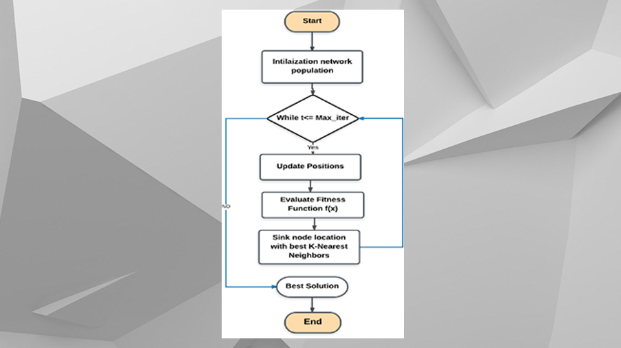
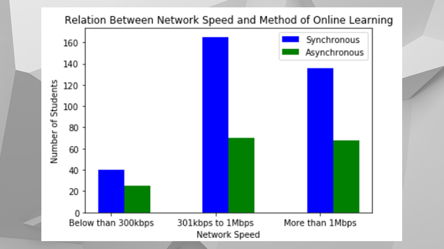
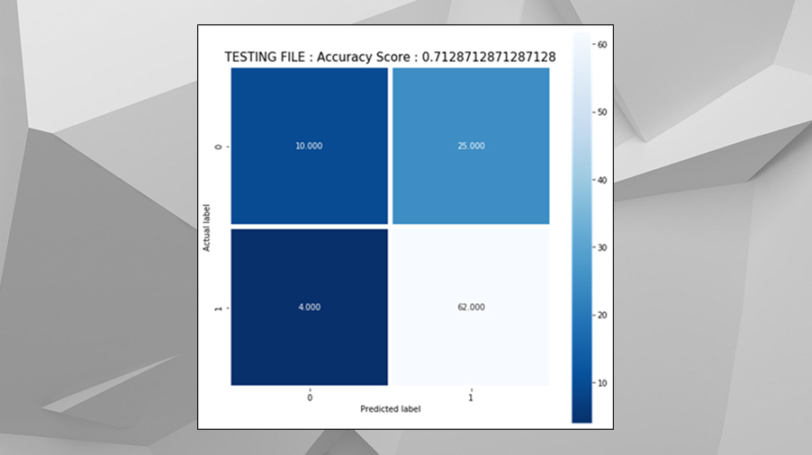

# Online-Class-Method-Prediction-using-Machine-Learning

#### During the pandemic of Covid-19, almost all students need to change their method in learning to online classes. This project is to predict the online class method either in Synchronous or Asynchronous method by train a model using Machine Learning. K-Nearest Neighbor (KNN) is used to train a dataset that contain almost 500 samples from students in Malaysia.

